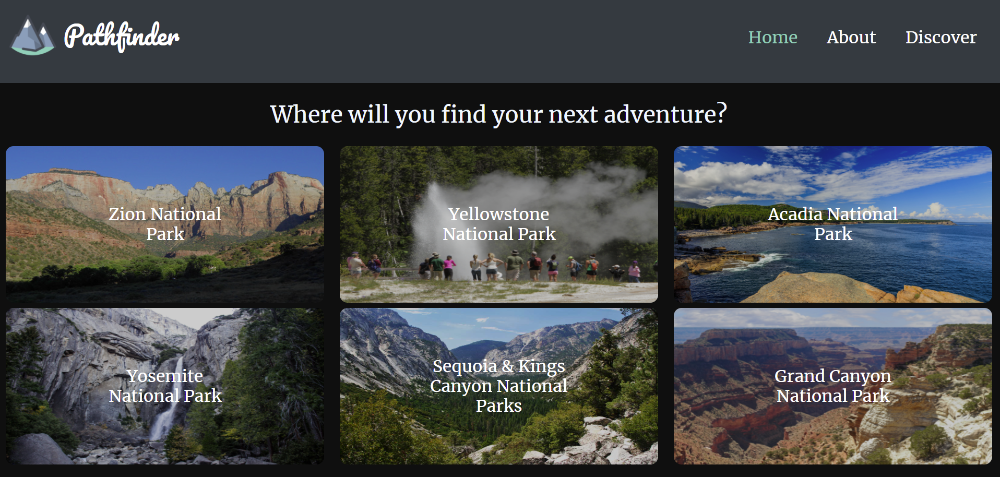
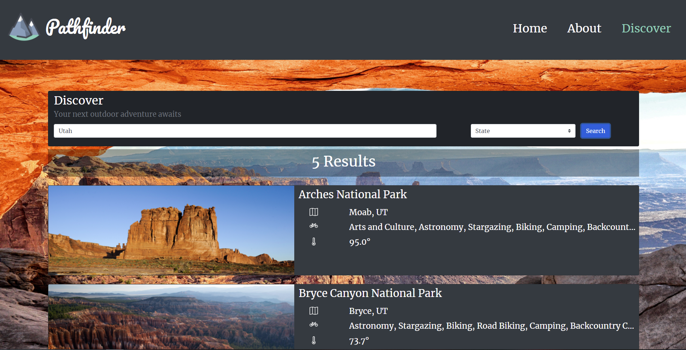
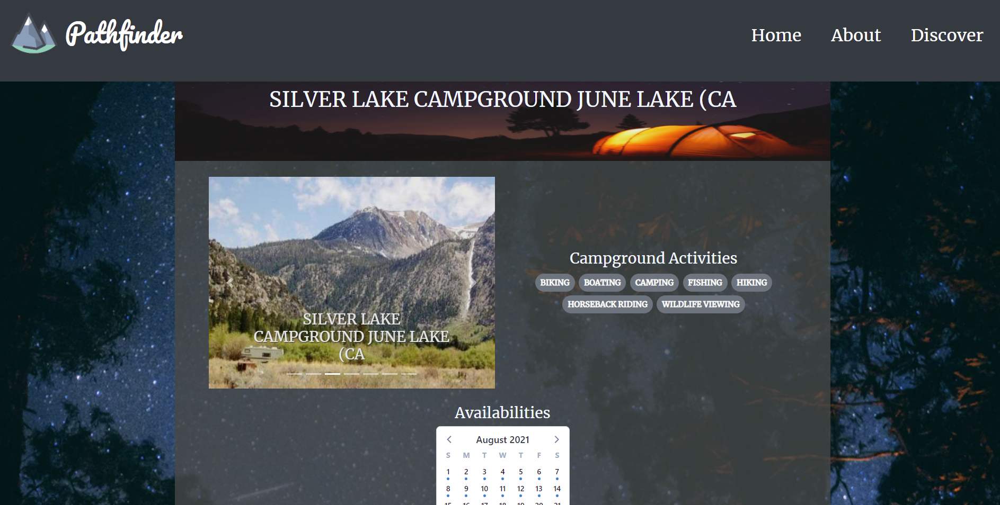
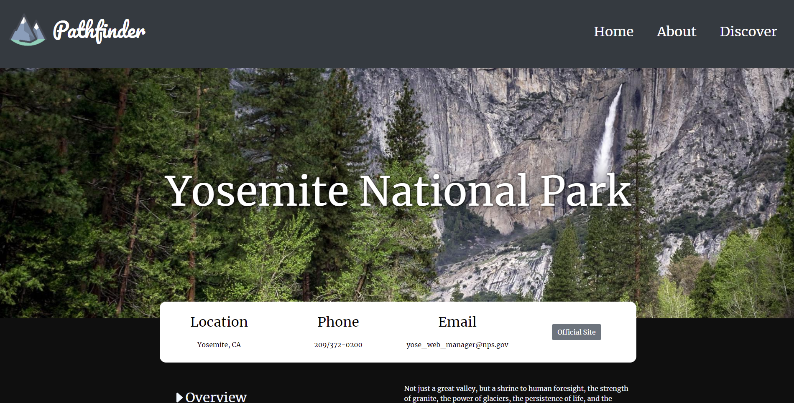

# Pathfinder


## [Link to Website](https://pathfinder-17a7e.web.app/)
### Introduction

Pathfinder is a responsive website designed to help you find your next adventure. 
The National Parks Service API is used to gather information about parks across america and the RIDB API provides campsite locations and availability.
It was created using Vue.js and Bootstrap as a school project. 

### Project setup
Install dependecies using Yarn

```
yarn install
```
Then simply serve to launch the development server

```
yarn serve
```

### Features
* Ability to search for parks by State or Name.
* Home Page featuring popular parks.
* Park pages provide general information and photos.
* Google map displaying park location.
* Campsite Descriptions and availability.

### Screenshots
_Home_


_Search_


_Campsite Info_


_Park Info_

